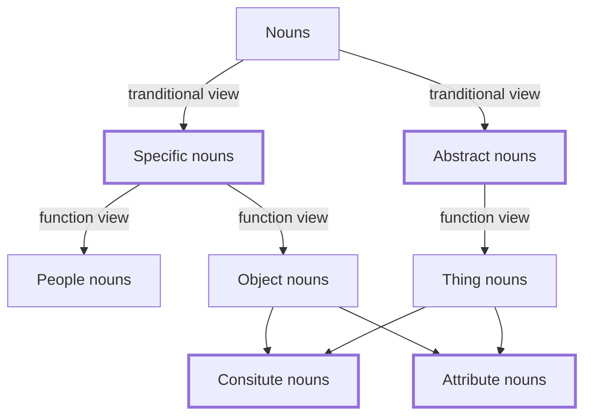

## 中篇 它们都是哪些è¯ï¼Ÿ

- åè¯ã€åŠ¨è¯ã€å½¢å®¹è¯ã€ä»‹è¯
- 副è¯ã€è¿è¯ã€ä»£è¯ã€æ•°è¯

### åè¯

åè¯çš„æ•°é‡æ˜¯æœ€å¤šçš„。

传统分类：

- 具体åè¯ï¼šçœ‹å¾—è§ã€æ‘¸å¾—ç€çš„东西
- 抽象åè¯ï¼šçœ‹ä¸è§ã€æ‘¸ä¸ç€çš„东西

ä»åŠŸèƒ½è§’度分类：

- 专用åè¯ï¼šå¦‚ sun, china, monday ç­‰
- 说“物â€çš„åè¯
- 说“人â€çš„åè¯
- 说â€äº‹â€œçš„åè¯

â€äººâ€œå’Œâ€ç‰©â€œçš„åè¯éƒ½æ˜¯å¯ä»¥çœ‹å¾—è§æ‘¸å¾—ç€çš„，å¯ä»¥å½’为â€å…·ä½“åè¯â€œï¼›è€Œâ€äº‹â€œå¤§å¤šæ˜¯è¯´äººåšçš„那些事情，比较抽象，所以归结为â€æŠ½è±¡åè¯â€œã€‚

â€äººâ€œã€â€äº‹â€œã€â€ç‰©â€œæˆ‘们分好了，但一般还è¦è¯´æ˜è¿™äº›äº‹ç‰©æ˜¯ç”±ä»€ä¹ˆç»„æˆçš„，这类åè¯å«åšâ€æ„æˆç±»åè¯â€œã€‚


```mermaid
flowchart TD
   A[Nouns] --> |tranditional view| B[Specific nouns]
   A --> |tranditional view| C[Abstract nouns]
   B --> |function view| D[People nouns]
   B --> |function view| E[Object nouns]
   C --> |function view| F[Thing nouns]
   E --> G[Consitute nouns]
   F --> G
   E --> H[Attribute nouns]
   F --> H
   
   style B stroke-width:3px
   style C stroke-width:3px
   style G stroke-width:3px
   style H stroke-width:3px
```

具体åè¯ï¼šèƒŒä¸‹æ¥å°±å¯ä»¥

Object nouns

time: 
```
morning, afternoon, evening, night, tonight, 
today, tomorrow, yesterday, weekend, month, year
season, spring, autumn, winter, day, date, moment,
period, history, future, birthday, holiday,
festival, schedule, age
```

weather:
```
rain, snow, wind, cloud
```

nature:
```
mountain, air, light, water, fire, ice, smoke,
heat, ground, sky, river, field, forest, sea, 
stone, star
```

plant:
```
grass, tree, crop(农作物)
```

animal:
```
bird(ğŸ¦),    cat(ğŸ±),     dog(ğŸ¶), 
horse(ğŸ´),   rabbit(ğŸ°),  elephant(ğŸ˜), 
bear(ğŸ»),    tiger(ğŸ…),   lion(ğŸ¦), 
bull(ğŸ‚),    cow(ğŸ®),     pig(ğŸ·), 
chicken(ğŸ”), fish(é±¼),    sheep(ğŸ‘), 
monkey(ğŸ’),  snake(ğŸ),   reptile(ğŸ)
```

insect:
```
bee(ğŸ), butterfly(🦋), spider(🕷)
```

bacteria(细èŒ)

place:
```
hospital(ğŸ¥), restaurant, hotel(ğŸ¨)
university, factory, jail(监狱)
zoo, park, school, store(店铺)
club, bar(é…’å§), court(法庭)
market, town, village, city
```

organization
```
company, charity(慈善机æ„)
```

sound
```
voice, noise, music
```

food
```
egg(🥚), meat, steak(牛æ’), bread(ğŸ)
cake(ğŸ°), dessert, soup, sandwich
noodle, pie(馅饼), chocolate, sause(酱)
```

meal
```
breakfast, lunch, dinner
```

vegetable
```
potato(🥔), tomato(ğŸ…), carrot(🥕)
letture(è´ç¬‹), bean(豆)
```

fruit
```
apple, orange(ğŸŠ), banana
```

ingredient
```
oil, sugar(趟), salt, butter(黄油🧈), cream(奶油)
```

drink
```
coffee, milk, tea, juice, beer, wine(è‘¡è„é…’), alcohol
```


