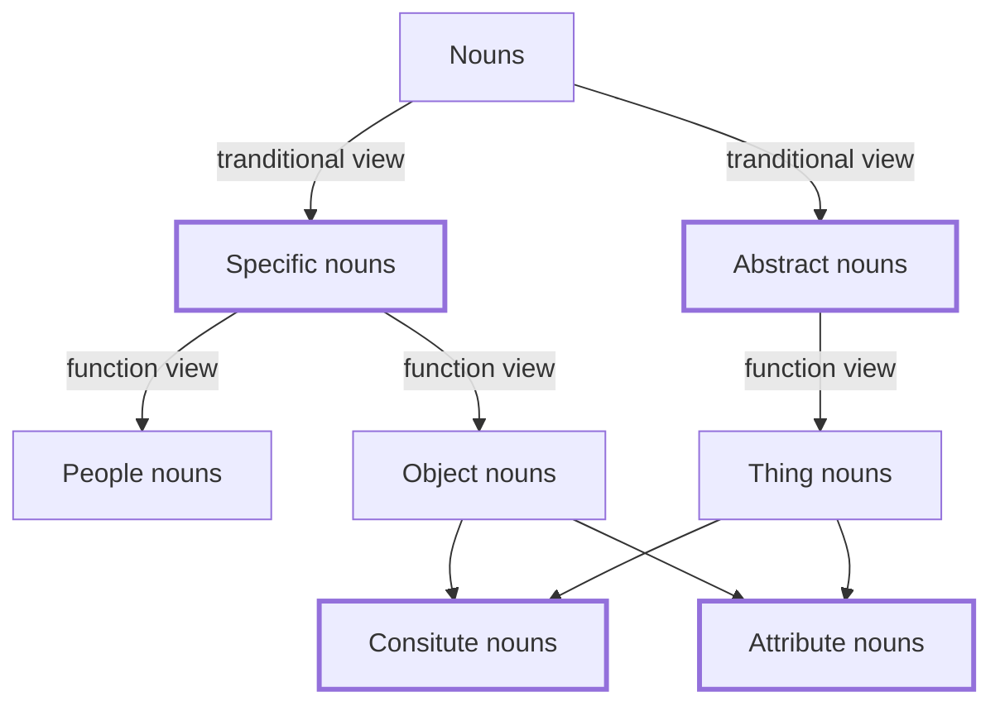

> [1368 Words 目录](./index.md)

## 中篇 它们都是哪些词？

- 名词、动词、形容词、介词
- 副词、连词、代词、数词

### 名词

名词的数量是最多的。

传统分类：

- 具体名词：看得见、摸得着的东西
- 抽象名词：看不见、摸不着的东西

从功能角度分类：

- 专用名词：如 sun, china, monday 等
- 说“物”的名词
- 说“人”的名词
- 说”事“的名词

”人“和”物“的名词都是可以看得见摸得着的，可以归为”具体名词“；而”事“大多是说人做的那些事情，比较抽象，所以归结为”抽象名词“。

”人“、”事“、”物“我们分好了，但一般还要说明这些事物是由什么组成的，这类名词叫做”构成类名词“。



具体名词：背下来就可以

Object nouns

时间类 time: 
```
morning, afternoon, evening, night, tonight, 
today, tomorrow, yesterday, weekend, month, year
season, spring, autumn, winter, day, date, moment,
period, history, future, birthday, holiday,
festival, schedule, age
```

天气类 weather:
```
rain, snow, wind, cloud
```

自然类 nature:
```
mountain, air, light, water, fire, ice, smoke,
heat, ground, sky, river, field, forest, sea, 
stone, star
```

植物类 plant:
```
grass, tree, crop(农作物)
```

动物类 animal:
```
bird(🐦),    cat(🐱),     dog(🐶), 
horse(🐴),   rabbit(🐰),  elephant(🐘), 
bear(🐻),    tiger(🐅),   lion(🦁), 
bull(🐂),    cow(🐮),     pig(🐷), 
chicken(🐔), fish(鱼),    sheep(🐑), 
monkey(🐒),  snake(🐍),   reptile(🐞)
```

昆虫类 insect:
```
bee(🐝), butterfly(🦋), spider(🕷)
```

bacteria(细菌)

地点类 place:
```
hospital(🏥), restaurant, hotel(🏨)
university, factory, jail(监狱)
zoo, park, school, store(店铺)
club, bar(酒吧), court(法庭)
market, town, village, city
```

组织类 organization
```
company, charity(慈善机构)
```

声音类 sound
```
voice, noise, music
```

食品类 food
```
egg(🥚), meat, steak(牛排), bread(🍞)
cake(🍰), dessert, soup, sandwich
noodle, pie(馅饼), chocolate, sause(酱)
```

肉类 meal
```
breakfast, lunch, dinner
```

蔬菜类 vegetable
```
potato(🥔), tomato(🍅), carrot(🥕)
letture(莴笋), bean(豆)
```

水果类 fruit
```
apple, orange(🍊), banana
```

配料 ingredient
```
oil, sugar(趟), salt, butter(黄油🧈), cream(奶油)
```

饮料类 drink
```
coffee, milk, tea, juice, beer, wine(葡萄酒), alcohol
```

营养类
```
nutrient 营养品 mineral 矿物 vitamin 维生素 protein 蛋白质
```

疾病类
```
disease 疾病 fever 发烧 flu 流行性感冒；流感；cancer 癌症
```

房屋类
```
house office room floor wall window door roof 屋顶 kitchen 厨房
```

家具类
```
furniture 家具 bed chair 椅子 desk table seat couch 沙发
```

服装类
```
clothes shirt 衬衫 shoes cap 帽子 
hat coat 上衣，外套 pants 裤子 
uniform 制服 suits 西服，西装 
underwear pocket 口袋 
jeans 牛仔裤 button 纽扣 zip 拉链
sock 短袜
```


