# MacOS 搭建 K51 单片机开发环境

- [K51 单片机开发 目录](./index.md)

本文目录：

- [前言](#一前言)
- [环境说明](#二环境说明)
- [从命令行编译烧录](#三从命令行编译烧录)
  - [简单原理介绍](#1-简单原理介绍)
  - [安装-k51-单片机-c-语言编译器](#2-安装-k51-单片机-c-语言编译器)
  - [安装烧录程序-stcgal](#3安装烧录程序-stcgal)
  - [在命令行下测试编译和烧录](#4-在命令行下测试编译和烧录)
- [从集成 IDE 编译烧录](#四从集成-ide-编译烧录)
  - [下载-platformio-for-clion-插件](#1-下载-platformio-for-clion-插件)
  - [在-clion-中创建-platformio-项目](#2-在-clion-中创建-platformio-项目)
  - [在-clion-中编译烧录程序](#3-在-clion-中编译烧录程序)
  - [clion-platformio-插件配置说明](#4-clion-platformio-插件配置说明)
    - [烧录的-usb-串口设备号](#1-烧录的-usb-串口设备号)
    - [编译烧录命令行的自动安装](#2-编译烧录命令行的自动安装)
    - [解决在-ide-中头文件提示找不到的问题](#3-解决在-ide-中头文件提示找不到的问题)
    - [解决引入的头文件提示未定义的标识符问题](#4-解决引入的头文件提示未定义的标识符问题)


## 一、前言

最近在学习单片机，今天跑通了第一个程序，在这里记录一下这个入门的过程。

首先我参考了知乎上的这篇文章 [如何入门单片机/嵌入式](https://zhuanlan.zhihu.com/p/44771282?utm_id=0)，对单片机开发的路线有了一个模糊笼统的认识。

在继续了解一些单片机/嵌入式的入门知识的同时，我在 C语言网 复习了一下 [C语言教程](https://www.dotcpp.com/course/c/) 和 [C语言函数库](https://www.dotcpp.com/course/lib/)，接着想继续学习上面的 [单片机课程](https://www.dotcpp.com/course/scm/)；不过上面的单片机教程中说到，需要先完成《手把手教你学51单片机》基础，所以我搜到了 B 站上的 [金沙滩 KST-51单片机 ](https://www.bilibili.com/video/BV1RJ411k74J/?p=1&vd_source=242281abf4f78a703efdf5ba4b810246) 教程。

在金沙滩的 KST-51 单片机教程中，所使用的是Windows操作系统及其配套软件，由于我使用的是 MacOS，所以单片机开发调试等集成环境需要另行摸索。在参考资料方面，我查找到了简书上的 [Mac下单片机开发环境的搭建](https://www.jianshu.com/p/d16025a34cfe) 教程和 [PlatformIO IDE搭建统一的物联网嵌入式开发环境](https://www.jianshu.com/p/1f68451ee99c) 教程。第一个教程是安装了编译器、烧录程序从命令行进行编译构建、下载到开发板上；第二个教程是使用 PlatformIO IDE 这个插件集成到 VS Code 或者 CLion 等编辑器上。这里分别记录一下这两种搭建单片机开发环境的过程。

## 二、环境说明

- 操作系统：`macOS Monterey 12.6`

## 三、从命令行编译烧录

### 1. 简单原理介绍

C 语言程序烧录到单片机上，需要先用支持单片机对应架构的编译器进行编译，得到中间文件（如 .ihx 或 .hex 文件），然后再使用烧录程序将中间文件下载到单片机的 FLASH 存储中，这样单片机才能运行对应的 C 语言程序逻辑。

### 2. 安装 K51 单片机 C 语言编译器

[SDCC](https://sdcc.sourceforge.net/) 是用于 Intel 8051 Maxim 80DS390 和 Zilog Z80 的 ANSI C 编译器，在 Mac 上可通过 brew 来安装：

```bash
brew install sdcc
```

使用 `sdcc --version` 查看是否安装成功：


### 3.安装烧录程序 stcgal

在 Mac 下烧录程序使用得比较多的是 [stcgal](https://github.com/grigorig/stcgal)，在 Github Release 页下载最新的版本包（我这里下载的是 [Release 1.6](https://github.com/grigorig/stcgal/archive/refs/tags/v1.6.tar.gz) 的版本），解压后打开进入 stcgal 目录，并执行以下语句进行安装：

```bash
./setup.py build
sudo ./setup.py install
```

安装完成后使用 `which stcgal` 来检查是否安装成功：


到这里理论上就可以对 C 语言程序进行编译烧录到单片机板子上了，但是如果本机缺少一些单片机开发板上的驱动程序的话，还需要对应的安装驱动程序。

这里以 金沙滩 出品的 [KST-51单片机](http://www.qdkingst.com/cn/disc51) 为例，开发板上默认已经集成了 USB 转串口模块，它上面使用的 CH340 芯片，需要下载 [Mac 对应的 CH341 驱动程序](https://www.wch.cn/download/CH341SER_MAC_ZIP.html) 安装即可。

如何确认驱动程序成功安装：

将单片机连接到电脑上然后在终端执行以下命令：

```bash
ls /dev/tty.wchusbser*
```

如果输出类似下面则说明驱动程序安装成功：

```bash
$ ls /dev/tty.wchusbser*
/dev/tty.wchusbserial142310
```

### 4. 在命令行下测试编译和烧录

1. 首先准备以下 C 语言程序，保存为 led.c：

```C
#include <8051.h>

// 声明 LED，P0_0 为教学板子上最右侧的 LED2
#define LED_SINGLE P0_0

#define ADDR_0 P1_0
#define ADDR_1 P1_1
#define ADDR_2 P1_2
#define ADDR_3 P1_3
#define EN_LED P1_4

// 延迟xx毫秒
void delay_ms(unsigned int s) {
  unsigned int x;
  for (s; s > 0; s--) {
    // 这里 x 设置为 98 猜测是和晶振电路的频率有关
    x = 98;
    while (x--)
      ;
  }
}

void turn_on_master_switch() {
  // 教学板子 LED 总开关
  ADDR_0 = 0;
  ADDR_1 = 1;
  ADDR_2 = 1;
  ADDR_3 = 1;
  EN_LED = 0;
}

_Noreturn void flash_single_led() {
  LED_SINGLE = P0_0;
  while (1) {
    // 高电平 - 低电平 点亮 LED_SINGLE
    LED_SINGLE = 0;
    delay_ms(200);
    // 高电平 - 高电平 熄灭 LED_SINGLE
    LED_SINGLE = 1;
    delay_ms(300);
  }
}

int main() {
  turn_on_master_switch();
  flash_single_led();
  return 0;
}
```

2. 使用 sdc 编译程序

```bash
sdcc led.c
```

sdcc 编译会生成很多目标文件，这里我们只需要 `.ihx` 后缀的文件即可：


3. 将代码烧录到单片机中

有了 `.ihx` 后我们就可以使用 stcgal 将其烧录到单片机中，执行以下命令：

```bash
stcgal -P stc89 -p /dev/tty.wchusbserial1410 led.ihx
```

这里的参数 -P 表示使用的是 stc89 型号， -p /dev/tty.wchusbserial1410 表示 usb 串口设备，led.ihx 是刚刚编译好的程序。此时 stcgal 会提示我们在等待单片机板子通电：


我们按下单片机开发板的电源开关按钮，stcgal即会进行烧录：


烧录完成后观察开发板上的 LED 灯的亮灭情况，来检测我们 C 源程序是否正确：


可以看到最右侧的 LED 小灯可以正常点亮和熄灭并且不停的循环，至此所有环境搭建完成，并顺利完成了第一个点亮小灯的 Demo！下一节我们再来讲如何在集成环境中搭建单片机开发环境......

## 四、从集成 IDE 编译烧录

上一节讲到，我们可以安装编译器和烧录软件后，在命令行手动进行编译和烧录单片机。这种方式虽然可行，但是更多时候我们希望在一个集成 IDE 环境里面进行开发和调试，在这里我们使用 [PlatformIO IDE](https://platformio.org/platformio-ide) 这个 IDE 集成插件。

PlatformIO 官网上的教程是结合 VS Code 编辑器来使用的，具体可参考 [PlatformIO IDE搭建统一的物联网嵌入式开发环境](https://www.jianshu.com/p/1f68451ee99c) 这个教程。我更习惯于在 CLion 编辑器中写 C/C++ 代码，下面就讲一下在 CLion 中如何集成 PlatformIO 插件进行单片机开发。

### 1. 下载 PlatformIO for CLion 插件

首先我们需要在 CLion 的插件中先安装 [PlatformIO for CLion](https://plugins.jetbrains.com/plugin/13922-platformio-for-clion) 这个插件，在安装过程中会提示需要连同 [Ini](https://plugins.jetbrains.com/plugin/6981-ini) 插件一起安装，点击确定后完成插件安装。

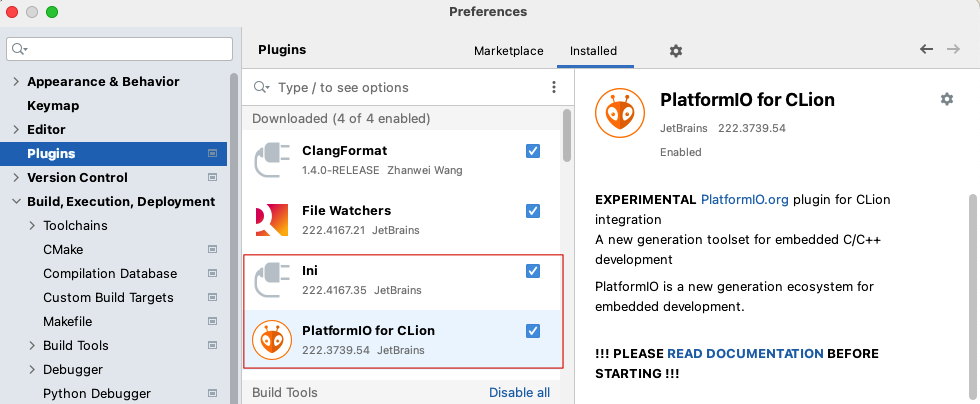

安装完 PlatformIO 插件后，我们还需要安装一下 [Platform Core(CLI)](https://platformio.org/install/cli)，这是 PlatformIO 的命令行工具，各个 IDE 的集成也都是用的这个 CLI 命令行提供的功能。在 Mac 执行以下安装命令：

```bash
brew install platformio
```

执行 `pio --version` 来确认 Platform Core(CLI) 已成功安装。

### 2. 在 CLion 中创建 PlatformIO 项目

在 CLion 中创建新项目，`File - New - Project - PlatformIO`，在 `Avaiable boards and frameworks` 中下拉到 `STC` 这一项，再点进去选择具体的某个单片机芯片型号，这里我们选择 `STC89C52RC` 这一项，点击 `Create` 即可完成项目创建：

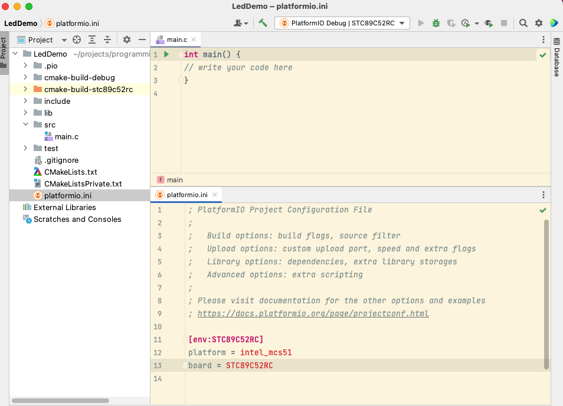

### 3. 在 CLion 中编译烧录程序

将上述 `led.c` 的内容粘贴到工程的 `main.c` 文件中，在构建选项中下拉选择 `PlatformIO Upload`：

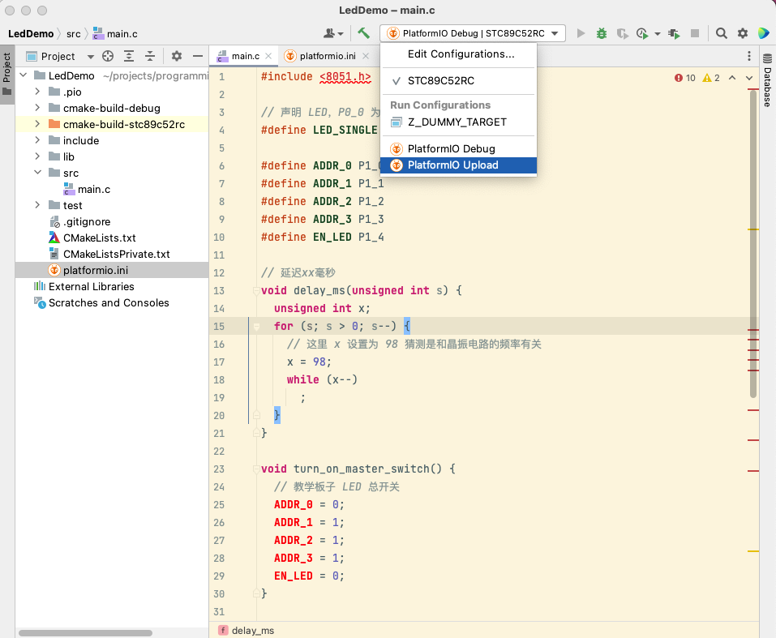

然后点击右侧的 `Build PlatformIO Upload` 构建按钮，此时 PlatformIO 插件就会进行编译构建并准备烧录到单片机板子上，并提示我们需要接通单片机的电源开关：

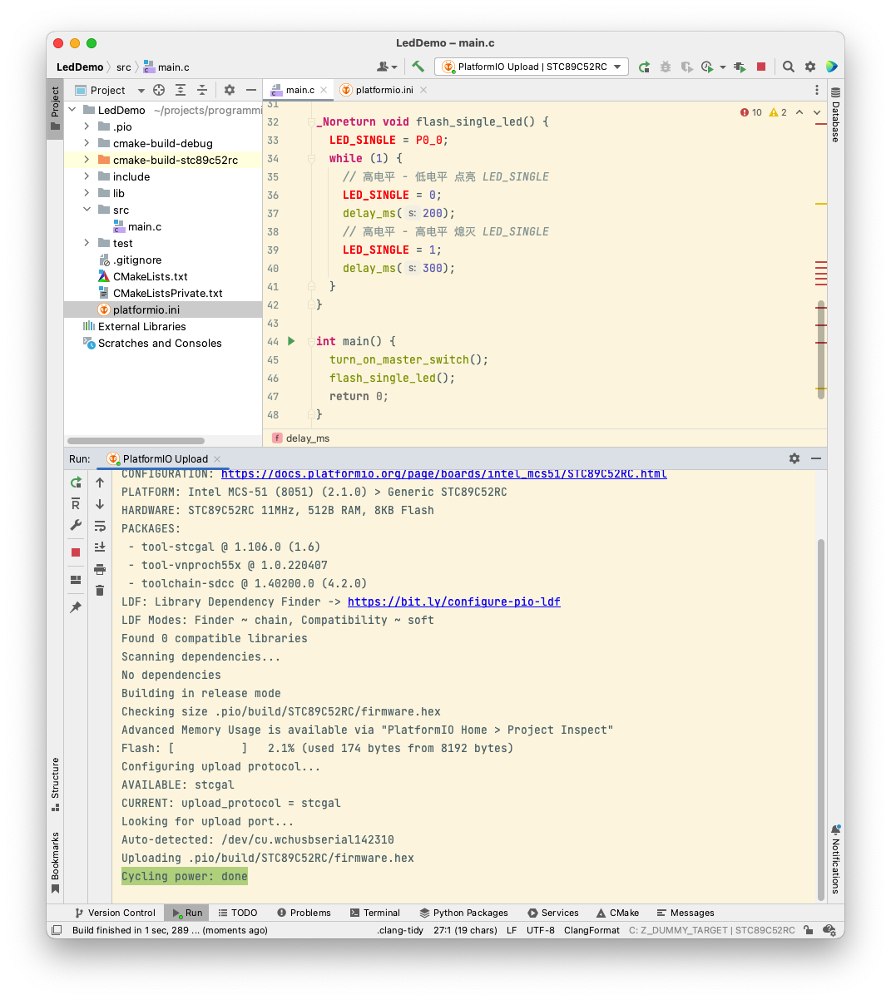

此时我们按下单片机电源开关，继续完成剩下的烧录过程：

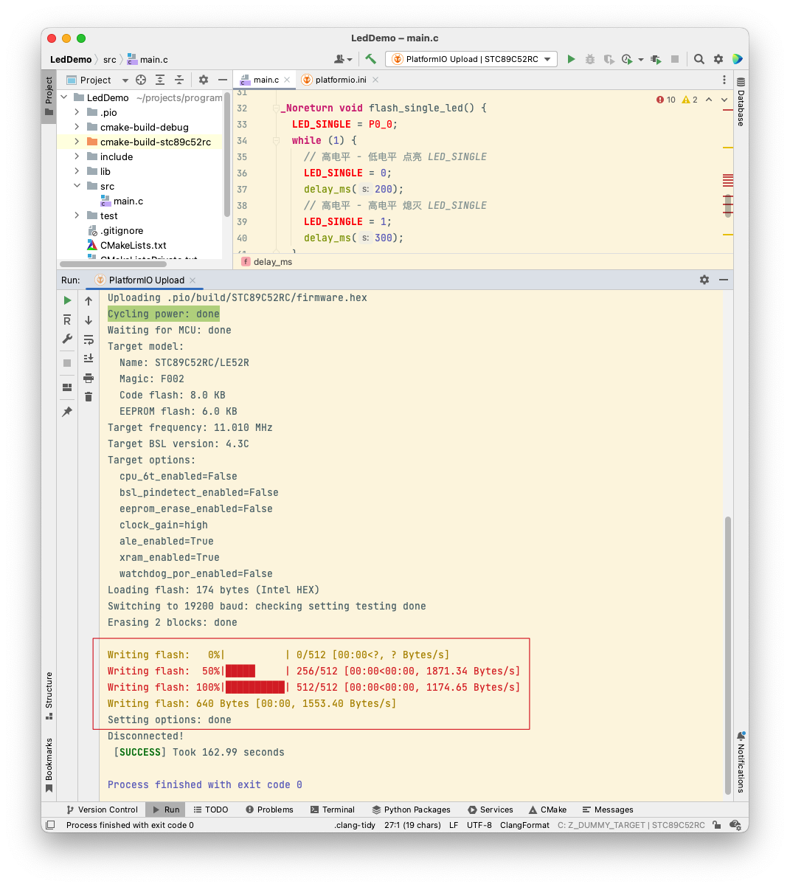

烧录完成后，可以看到单片机上的 LED 小灯一闪一闪的。到这里我们的集成开发环境就基本搭建完成了。

### 4. CLion PlatformIO 插件配置说明

#### 1. 烧录的 USB 串口设备号

可以看到在 CLion 中我们并没有指定对应的单片机的串口设备号就可以直接烧录到板子上了，这是因为 CLion PlatformIO 插件可以自动检测到对应的外设（假设只有一个外设的前提下），然后自动烧录到对应的外设上。

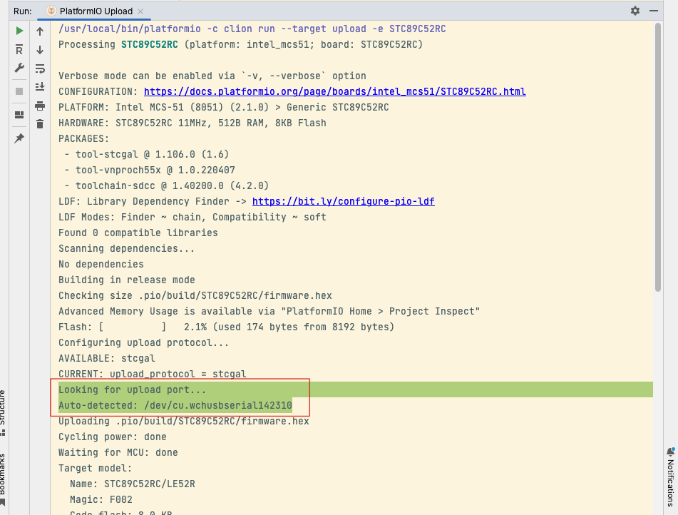

我们也可以显示的配置需要烧录的对应串口设备号，在 `platformio.ini` 文件中声明 `upload_port` 即可：

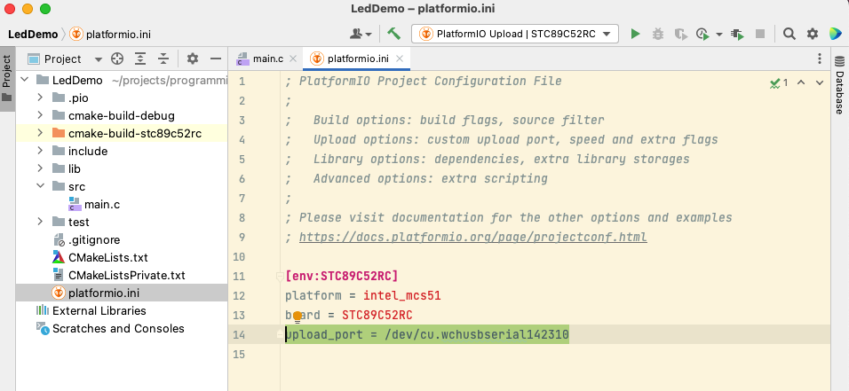

#### 2. 编译烧录命令行的自动安装

可以看到在 CLion PlatformIO 插件中我们并没有配置具体去编译和烧录的 `sdcc`, `stcgal` 等工具，但是我们创建的 `STC89C52RC` 这一个单片机芯片架构也是需要使用 `sdcc`, `stcgal` 这些工具具体去完成对应的编译和烧录功能的，PlatformIO 插件是怎么做到自动完成的呢？

这是因为 CLion PlatformIO 插件中的 Tool Manager 帮我们自动检测所构建的 PCB 版类型所需要要的构建工具有哪些，并进行自动化安装。以下面这条构建命令为例：

```bash
/usr/local/bin/platformio -c clion run --target upload -e STC89C52RC
```

CLion PlatformIO 的 Tool Manager 会自动检测出需要安装的编译烧录工具，然后下载安装到 `~/.platformio/packages/` 目录下：

```
➜  LedDemo ll ~/.platformio/packages
total 0
drwx------  14 litong.deng  staff   448B 10  6 10:13 tool-scons
drwx------  13 litong.deng  staff   416B 10  6 10:14 tool-stcgal
drwx------   6 litong.deng  staff   192B 10  6 10:14 tool-vnproch55x
drwx------   8 litong.deng  staff   256B 10  6 10:13 toolchain-sdcc
```

然后 CLion PlatformIO 插件就可以使用对应的工具包进行具体的编译、烧录等功能了。这里节省了手工操作，提高了开发效率！

#### 3. 解决在 IDE 中头文件提示找不到的问题

上述过程虽然可以正常编译烧录到板子上进行验证，但是在 CLion 编辑器中居然提示找不到 <8051.h> 这个头文件或者引用了未定义的标识符：

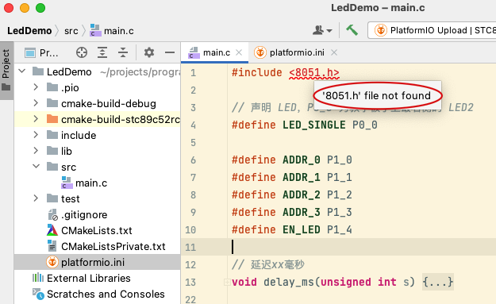

这是怎么回事呢？

原因是在PlatformIO 插件进行编译的过程中会去自动的链接 Tool Manager 中管理到的依赖，但是 CLion PlatformIO 插件创建的项目是使用 CMakeLists.txt 进行管理依赖的，在 CMakeLists.txt 中未声明的依赖库是不会被 CLion 自动包含进来进行解析的，所以就导致了在运行 `platformio` 命令使用 `sdcc` 编译的时候能找到 `~/.platformio/packages/toolchain-sdcc` 下面的依赖库，但是 CLion 并不知道对应的头文件的位置从而提示报错解析不到对应的头文件。

解决方案：

确定了是 CMakeLists.txt 引入依赖库的路径解析问题后就简单了，我们只需要在 CMakeLists.txt 将对应的头文件目录引入进来即可：


```txt
include_directories("~/.platformio/packages/toolchain-sdcc/share/sdcc/include/mcs51")
```

可以看到，引入对应的目录后对应的头文件就能正常解析了，可以点进去查看头文件详情：

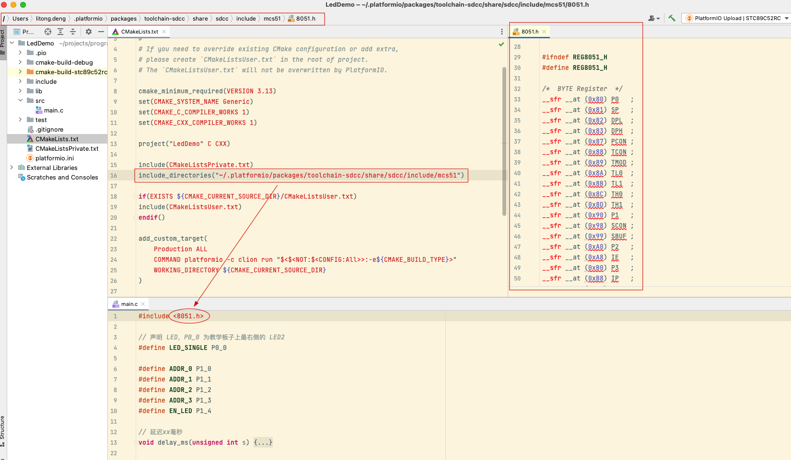

#### 4. 解决引入的头文件提示未定义的标识符问题

接上图，在打开的 <8051.h> 头文件中看到定义的标识符标红了，在 C 源程序中看到的提示为 `User of undeclared identifier P0_0`：

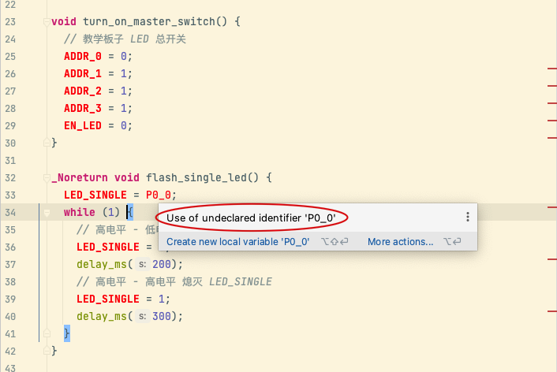

这是因为在 <8051.h> 头文件中使用了 <lint.h> 这个头文件却没有包含进来，我们在 <8051.h> 中引入 <lint.h> 即可：

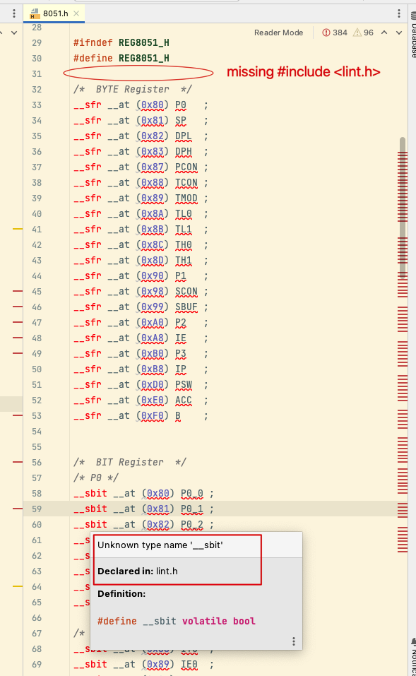

    猜测可能是 PlatformIO 插件在安装对应的 packages 的时候对于的包版本有 bug 或者没有更新（当然这不影响编译，可能在 PlatformIO 命令行编译的时候已经提前包含进来了所以这里没有再次包含？）

最后，贴一张在 IDE 中能正常解析的图，这样看着就舒服多了：

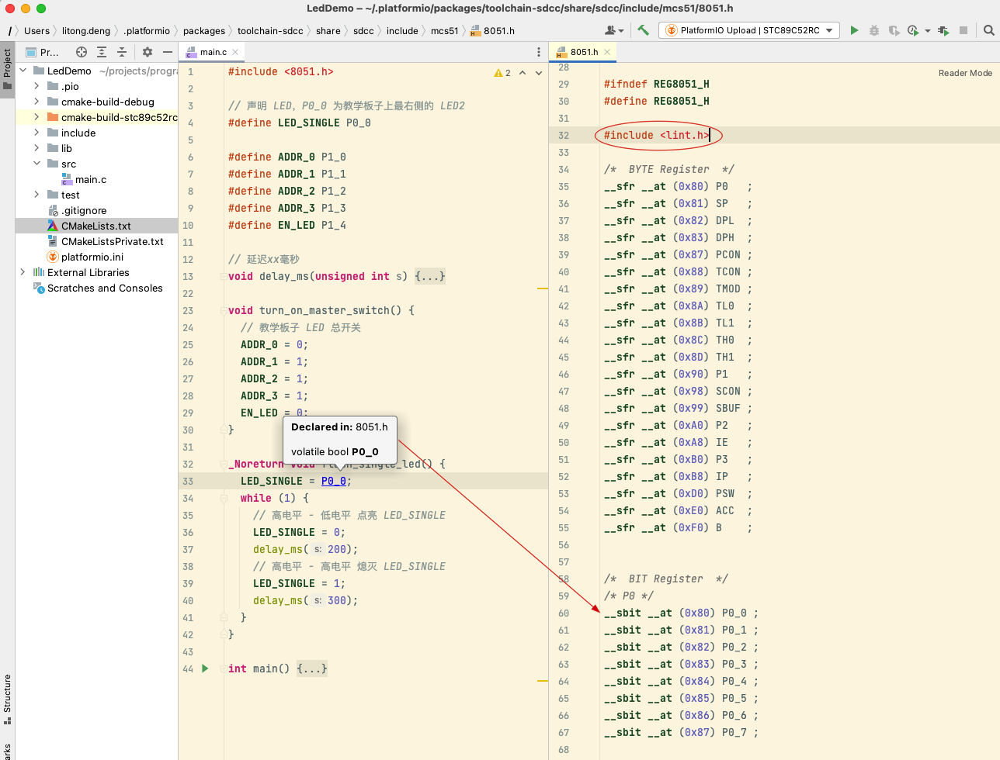

----

至此，在 IDE 集成环境中搭建单片机开发环境就告一段落了，终于可以愉快的进行玩耍了！