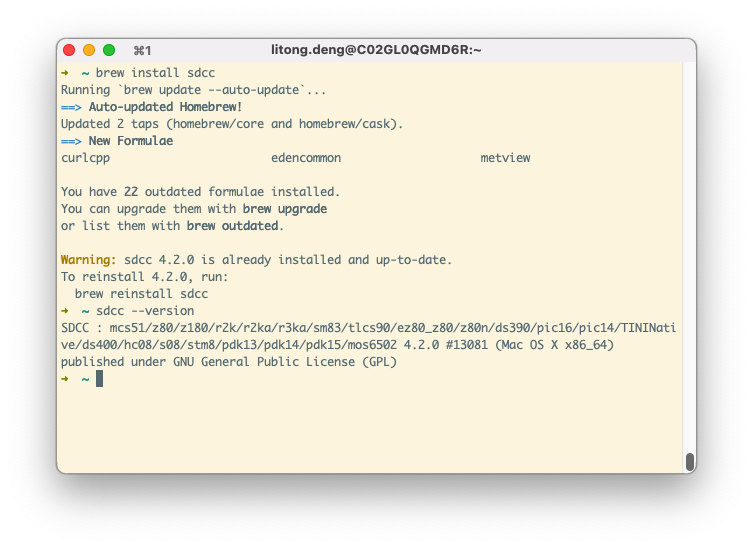
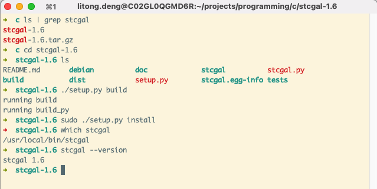
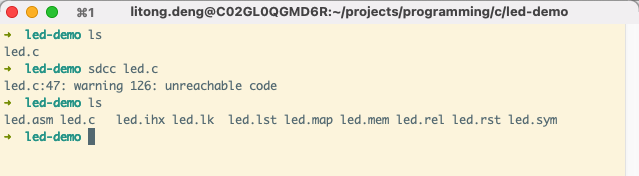
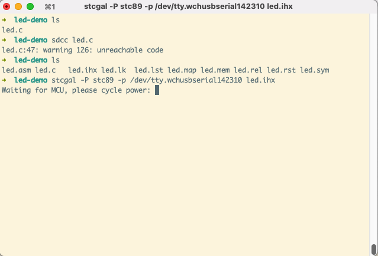
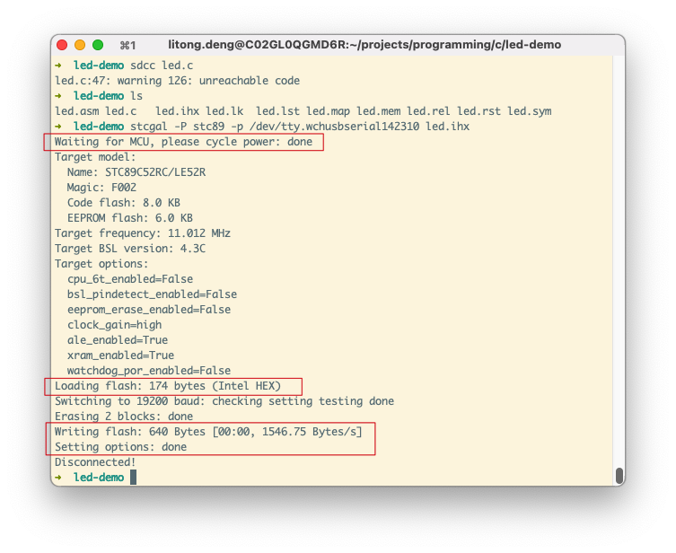
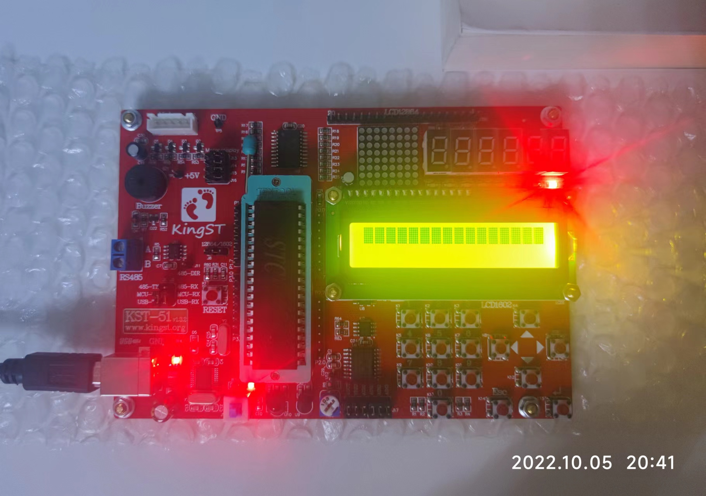

# MacOS 搭建 K51 单片机开发环境

- [K51 单片机开发 目录](./index.md)

## 一、前言

最近在学习单片机，今天跑通了第一个程序，在这里记录一下这个入门的过程。

首先我参考了知乎上的这篇文章 [如何入门单片机/嵌入式](https://zhuanlan.zhihu.com/p/44771282?utm_id=0)，对单片机开发的路线有了一个模糊笼统的认识。

在继续了解一些单片机/嵌入式的入门知识的同时，我在 C语言网 复习了一下 [C语言教程](https://www.dotcpp.com/course/c/) 和 [C语言函数库](https://www.dotcpp.com/course/lib/)，接着想继续学习上面的 [单片机课程](https://www.dotcpp.com/course/scm/)；不过上面的单片机教程中说到，需要先完成《手把手教你学51单片机》基础，所以我搜到了 B 站上的 [金沙滩 KST-51单片机 ](https://www.bilibili.com/video/BV1RJ411k74J/?p=1&vd_source=242281abf4f78a703efdf5ba4b810246) 教程。

在金沙滩的 KST-51 单片机教程中，所使用的是Windows操作系统及其配套软件，由于我使用的是 MacOS，所以单片机开发调试等集成环境需要另行摸索。在参考资料方面，我查找到了简书上的 [Mac下单片机开发环境的搭建](https://www.jianshu.com/p/d16025a34cfe) 教程和 [PlatformIO IDE搭建统一的物联网嵌入式开发环境](https://www.jianshu.com/p/1f68451ee99c) 教程。第一个教程是安装了编译器、烧录程序从命令行进行编译构建、下载到开发板上；第二个教程是使用 PlatformIO IDE 这个插件集成到 VS Code 或者 CLion 等编辑器上。这里分别记录一下这两种大家单片机开发环境的过程。

## 二、环境说明

- 操作系统：`macOS Monterey 12.6`

## 三、从命令行编译烧录

### 1. 简单原理介绍

C 语言程序烧录到单片机上，需要先用支持单片机对应架构的编译器进行编译，得到中间文件（如 .ihx 或 .hex 文件），然后再使用烧录程序将中间文件下载到单片机的 FLASH 存储中，这样单片机才能允许对应的 C 语言程序逻辑。

### 2. 安装 K51 单片机 C 语言编译器

[SDCC](https://sdcc.sourceforge.net/) 是用于 Intel 8051 Maxim 80DS390 和 Zilog Z80 的 ANSI C 编译器，在 Mac 上可通过 brew 来安装：

```bash
brew install sdcc
```

使用 `sdcc --version` 查看是否安装成功：



### 3.安装烧录程序 stcgal

在 Mac 下烧录程序使用得比较多的是 [stcgal](https://github.com/grigorig/stcgal)，在 Github Release 页下载最新的版本包（我这里下载的是 [Release 1.6](https://github.com/grigorig/stcgal/archive/refs/tags/v1.6.tar.gz) 的版本），解压后打开进入 stcgal 目录，并执行以下语句进行安装：

```bash
./setup.py build
sudo ./setup.py install
```

安装完成后使用 `which stcgal` 来检查是否安装成功：



到这里理论上就可以对 C 语言程序进行编译烧录到单片机板子上了，但是如果本机缺少一些单片机开发板上的驱动程序的话，还需要对应的安装驱动程序。

这里以 金沙滩 出品的 [KST-51单片机](http://www.qdkingst.com/cn/disc51) 为例，开发板上默认已经集成了 USB 转串口模块，它上面使用的 CH340 芯片，需要下载 [Mac 对应的 CH341 驱动程序](https://www.wch.cn/download/CH341SER_MAC_ZIP.html) 安装即可。

如何确认驱动程序成功安装：

将单片机连接到电脑上然后在终端执行以下命令：

```bash
ls /dev/tty.wchusbser*
```

如果输出类似下面则说明驱动程序安装成功：

```bash
$ ls /dev/tty.wchusbser*
/dev/tty.wchusbserial142310
```

### 4. 在命令行下测试编译和烧录

1. 首先准备以下 C 语言程序，保存为 led.c：

```C
#include <8051.h>

// 声明 LED，P0_0 为教学板子上最右侧的 LED2
#define LED_SINGLE P0_0

#define ADDR_0 P1_0
#define ADDR_1 P1_1
#define ADDR_2 P1_2
#define ADDR_3 P1_3
#define EN_LED P1_4

// 延迟xx毫秒
void delay_ms(unsigned int s) {
  unsigned int x;
  for (s; s > 0; s--) {
    // 这里 x 设置为 98 猜测是和晶振电路的频率有关
    x = 98;
    while (x--)
      ;
  }
}

void turn_on_master_switch() {
  // 教学板子 LED 总开关
  ADDR_0 = 0;
  ADDR_1 = 1;
  ADDR_2 = 1;
  ADDR_3 = 1;
  EN_LED = 0;
}

_Noreturn void flash_single_led() {
  LED_SINGLE = P0_0;
  while (1) {
    // 高电平 - 低电平 点亮 LED_SINGLE
    LED_SINGLE = 0;
    delay_ms(200);
    // 高电平 - 高电平 熄灭 LED_SINGLE
    LED_SINGLE = 1;
    delay_ms(300);
  }
}

int main() {
  turn_on_master_switch();
  flash_single_led();
  return 0;
}
```

2. 使用 sdc 编译程序

```bash
sdcc led.c
```

sdcc 编译会生成很多目标文件，这里我们只需要 `.ihx` 后缀的文件即可：



3. 将代码烧录到单片机中

有了 `.ihx` 后我们就可以使用 stcgal 将其烧录到单片机中，执行以下命令：

```bash
stcgal -P stc89 -p /dev/tty.wchusbserial1410 pmd.ihx
```

此时 stcgal 会提示我们在等到单片机板子通电：



我们按下单片机开发板的电源开关按钮，stcgal即会进行烧录：



烧录完成后观察开发板上的 LED 灯的亮灭情况，来检测我们 C 源程序是否正确：



可以看到最右侧的 LED 小灯可以正常点亮和熄灭并且不停的循环，至此所有环境搭建完成，并顺利完成了第一个点亮小灯的 Demo！下一节我们再来讲如何在集成环境中搭建单片机开发环境......

## 四、从集成 IDE 编译烧录