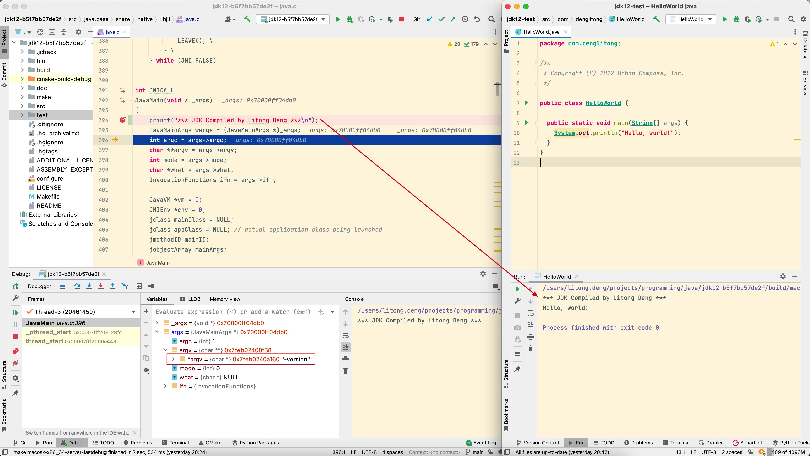
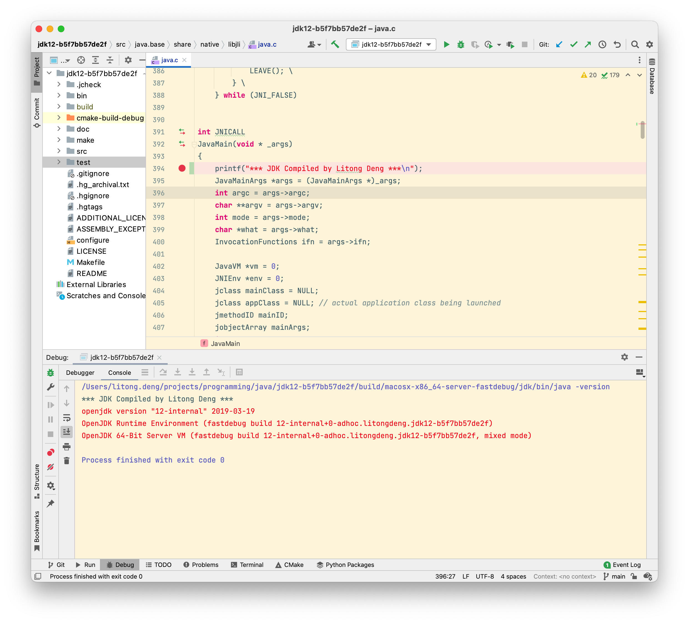

## 第1章 走进Java

- [深入理解Java虚拟机 目录](./index.md)

<em>世界上并没有完美的程序，但我们并不因此而沮丧，因为写程序本来就是一个不断追求完美的过程。</em>

Java 技术体系包括：

- Java 程序设计语言
- 各种硬件平台上的 Java 虚拟机
- Class 文件格式
- Java API 类库
- 来自商业机构和开源社区的第三方 Java 类库

Java 程序设计语言 + Java 虚拟机 + Java API 类库 = JDK (Java Development Kit), JDK 是用于支持 Java 程序开发的最小环境。

Java SE API 子集 + Java 虚拟机 = JRE (Java Runtime Environment), JRE 是支持 Java 程序运行的标准环境。

Java 技术体系的平台划分：

- Java Card: 支持一些 Java 小程序（Applets）运行在小内存设备（如智能卡）上的平台
- Java ME (Micro EDITION): 支持 Java 程序运行在移动终端（手机、PDA）上的平台，对 Java API 有所精简。
- Java SE (Standard Edition): 支持面向桌面级应用的 Java 平台，提供了完整的 Java 核心 API。
- Java EE (Enterprise Edition): 支持使用多层架构的企业应用的 Java 平台，除了核心 API 外还做了大量的扩充并提供了相关的部署支持。

JDK历史版本：

- JDK 1.0 版本的代表技术：Java 虚拟机, Applet, AWT(Abstract Window Toolkit) 等
- JDK 1.1 版本的代表技术：JAR 文件格式, JDBC, JavaBeans, RMI(Remote Method Invocation), 语法上新增了 内部类 Inner Class, 反射 Reflection
- JDK 1.2 Java 技术体系拆分为 3 个方向：J2SE, J2EE, J2ME，代表技术有：EJB, Java Plug-in, Java IDL, Swing 等，同时 Java 虚拟机第一次内置了 JIT(Just In Time)编译器，语法上新增了 strictfp 关键字，Collections 集合类
- JDK 1.3 改进项主要在于一些类库上（数学运算和新的 Timer API等），JNDI 服务，RMI 通信协议，以及提供了大量的 Java 2D API, JavaSound 类库等
- JDK 1.4 是 Java 真正走向成熟的一个版本，新增的技术特性有：正则表达式, 异常链, NIO, 日志类, XML 解析器和 XSLT 转换器等
- JDK 1.5 在语法易用性上有很大的改进，如：自动装箱, 泛型, 动态注解, 枚举, 可变长参数, foreach 循环等，改进了 Java 内存模型（Java Memory Model），提供了 java.util.concurrent 并发包等
- JDK 1.6 的改进包括：提供动态语言支持（通过内置 Mozilla JavaScript Rhino 引擎实现），提供编译 API 和微型 HTTP 服务器 API 等，对 Java 虚拟机内部做了大量改进包括锁与同步、垃圾收集、类加载等
- JDK 1.7 主要改进包括：提供新的 G1 收集器、升级类加载架构、加强对非 Java 语言的调用支持（JSR-S9S）等
- JDK 1.8 包括 Lambda 表达式 等
- JDK 9 包括 Jigsaw 模块化
- JDK 10 主要目标是内部重构：统一源仓库、统一垃圾收集器、统计即时编译器接口等、本地类型推断
- JDK 11 包括了 ZGC 垃圾收集器、本地类型推断加入 Lambda 语法；以及“Java 要开始收费了！”（Oracle 从 JDK 11 起把以前的商业特性全部开源给 OpenJDK，这样 OpenJDK 11和 OracleJDK 11的代码和功能本质上就是完成相同的；另外 Oracle OpenJDK 在 GPLv2+CE 协议下发行的版本允许免费使用，但只有半年的更新支持；而在 OTN 协议下发行的传统的 OracleJDK 有三年的更新支持，但是需要付费）

        商业用户要么不断升级 JDK 的版本，要么就去购买商业支持。

- JDK 12 包含了 Switch 表达式、Java 微测试套件（JMH）等
- JDK 13 包含了文本块功能 Text Blocks，可以节省拼接 HTML、SQL 等场景里大量的“+”拼接操作。

Java 虚拟机发展史

Sun Classic: 世界上第一款商用 Java 虚拟机，只能用纯解释器方式来执行 Java 代码
Exact VM: 两级即时编译器、编译器与解释器混合工作模式、准确式内存管理（知道内存上某个位置的数据具体是什么类型）
Sun HostSpot VM: JDK1.3之后的默认虚拟机，准确式 GC，热点代码探测
BEA JRockit VM: 垃圾回收器，MissionControl 服务
Liquid VM: 自身实现了一个专用操作系统的必要功能，如文件系统、网络支持等，由虚拟机越过操作系统直接控制硬件，不需要再进行内核态/用户态的切换
Graal VM: Run Programs Faster Any where，在 HotSpot 虚拟机基础上增强而成的跨语言全栈虚拟机，通过解释器将各种语言的源代码编译成 Graal VM 可以接受的中间格式。
Substrate VM: 提前编译，降低内存占用及启动时间。

        模块化编译不仅是条件编译，更重要的是接口与实现的分离。

编译 JDK

- 获取源码

    [https://hg.openjdk.java.net/jdk/jdk12/rev/b67884871b5f](https://hg.openjdk.java.net/jdk/jdk12/rev/b67884871b5f)
    [https://hg.openjdk.java.net/jdk/jdk12/archive/b67884871b5f.zip](https://hg.openjdk.java.net/jdk/jdk12/archive/b67884871b5f.zip)

- 安装编译依赖库

    ```
    brew install freetype && brew link --overwrite freetype  
    brew install cups  
    brew install libx11 libxext libxrender libxrandr libxtst libxt  
    brew install portaudio (代替  brew install alsa-lib)  
    brew install libffi  
    brew install autoconf  
    ```
    
- 开始编译

    ```
    make clean && make dist-clean  
    bash configure --enable-debug --with-jvm-variants=server  
    make images
    ```

- 修复源码中的 Bug

    缺少逗号：
    ```
    +++ test/hotspot/gtest/logging/logTestUtils.inline.hpp
    @@ -31,7 +31,7 @@
    -   "=", "+", " ", "+=", "+=*", "*+", " +", "**", "++", ".", ",", ",," ",+",
    +   "=", "+", " ", "+=", "+=*", "*+", " +", "**", "++", ".", ",", ",,", ",+",
    ```

    ```
    +++ test/hotspot/gtest/logging/test_logFileOutput.cpp
    @@ -79,7 +79,7 @@
    -   "filesize=9999999999999999999999999"
    +   "filesize=9999999999999999999999999",
    ```
    
    类型问题：
    ```
    +++ src/hotspot/share/runtime/sharedRuntime.cpp
    @@ -2870,7 +2870,7
    -   buffer.insts()->initialize_shared_locs((relocInfo*)locs_buf, sizeof(locs_buf) / sizeof(relocInfo));
    +   buffer.insts()->initialize_shared_locs((relocInfo*)locs_buf, (sizeof(locs_buf)) / (sizeof(relocInfo)));
    ```

    字符串定义问题：
    ```
    +++ src/hotspot/share/runtime/arguments.cpp
    @@ -1449,7 +1449,7 @@
    -   if (old_java_vendor_url_bug != DEFAULT_VENDOR_URL_BUG) {
    +   if (strcmp(old_java_vendor_url_bug, DEFAULT_VENDOR_URL_BUG) != 0) {
    ```

    赋值问题：
    ```
    +++ test/hotspot/gtest/classfile/test_symbolTable.cpp
    @@ -59,7 +59,7 @@
    -   s1 = s1; // self assignment
    +   // s1 = s1; // self assignment

    +++ src/java.desktop/macosx/native/libjsound/PLATFORM_API_MacOSX_MidiUtils.c
    @@ -260,9 +260,9 @@
    -   static MIDIClientRef client = (MIDIClientRef) NULL;
    -   static MIDIPortRef inPort = (MIDIPortRef) NULL;
    -   static MIDIPortRef outPort = (MIDIPortRef) NULL;
    +   static MIDIClientRef client = (MIDIClientRef) 0;
    +   static MIDIPortRef inPort = (MIDIPortRef) 0;
    +   static MIDIPortRef outPort = (MIDIPortRef) 0;

    @@ -468,7 +468,7 @@
    -   MIDIEndpointRef endpoint = (MIDIEndpointRef) NULL;
    +   MIDIEndpointRef endpoint = (MIDIEndpointRef) 0;
    ```

    Xcode13 兼容性问题：
    ```
    +++ src/java.base/unix/native/libjava/ProcessImpl_md.c
    @@ -348,7 +348,7 @@
    -   #ifndef __solaris__
    +   #ifndef __APPLE__

    @@ -479,7 +479,7 @@
    -   #ifndef __solaris__
    +   #ifndef __APPLE__
    ```

    少括号：
    ```
    +++ src/java.desktop/macosx/native/libawt_lwawt/awt/CSystemColors.m
    @@ -131,7 +131,7 @@
    -   if (colorIndex < (useAppleColor) ? sun_lwawt_macosx_LWCToolkit_NUM_APPLE_COLORS : java_awt_SystemColor_NUM_COLORS) {
    +   if (colorIndex < ((useAppleColor) ? sun_lwawt_macosx_LWCToolkit_NUM_APPLE_COLORS : java_awt_SystemColor_NUM_COLORS)) {
    ```
- 在 IDE 中调试

    **用 Compilation Database代替 CMakeChecklist.txt**
    JDK 12 网上找不到 CMakeChecklist.txt，需要使用 Clion 的 Compilation Database。  
    
    在 JDK 根目录下生成 compile-commands.json 文件（生成的文件在 build/macosx-x86_64-server-fastdebug 目录下）：  
    
    ```
    make CONF=macosx-x86_64-server-fastdebug compile-commands  
    ```

    使用 Clion 的 File -> open 打开上述的 compile-commands.json，选择 Open As a project，让 Clion 开始建立索引。

    建立完索引后会提示项目的根路径不对，通过 Tools -> Compilation Database -> Change Project Root 功能，选中 openjdk12 源码的根目录，改变完根目录之后，通过 Tools -> Compilation Database -> Reload Compilation Database Project 重新加载一次。

    **Build 配置**

    通过 Preferences --> Build, Exceution, Deployment --> Custom Build Targets 配置构建目标，选择 build 后面的 … 打开 External Tools 窗口，然后选择 + 到 Create Tool窗口，添加两个 tool，一个 make (执行内容是 make macosx-x86_64-server-fastdebug)，一个 make clean (执行内容是 make macosx-x86_64-server-fastdebug clean)。

    通过这两个配置每次构建之前都会重新编译我们的 jdk, 修改 jvm 代码之后可以直接进行重新调试。

    **Debug 配置**

    选择 Add configuration-> ± > Customer Build Applicatio, Executable：选择 ${source_root}/build/macosx-x86_64-server-fastdebug/jdk/bin/java, 或者其它你想调试的文件，比如 javac, Program arguments 这里可以写个 -version (或者对应的 executalbe 希望处理的参数)。

    **忽略 SIGEGV 和 SIGBUS 信号**
    在 ${source_root}/src/java.base/share/native/libjli/java.c 的 406 行打断点，点击 Debug, 然后 F9 放掉，会遇到下面这个问题：

    ```Debugger report unrelated range ...```

    由于我们使用的 LLDB 进行 debug 的，所以在进入第一个断点的时候在 LLDB 下执行以下命令忽略SIGEGV和SIGBUS信号可以避免此类问题:  
    ```pro hand -p true -s false SIGSEGV SIGBUS```

    将其添加到 ~/.lldbinit 文件中，避免每次都需要手动设置：

    ```
    vim ~/.lldbinit
    输入并保存: br set -n main -o true -G true -C "pro hand -p true -s false SIGSEGV SIGBUS“
    ```

    贴两张调试成功的截图：
    
    

    **参考链接**
    - [https://blog.csdn.net/qq_33543634/article/details/121153063](https://blog.csdn.net/qq_33543634/article/details/121153063)
    - [https://python.iitter.com/other/265745.html](https://python.iitter.com/other/265745.html)
